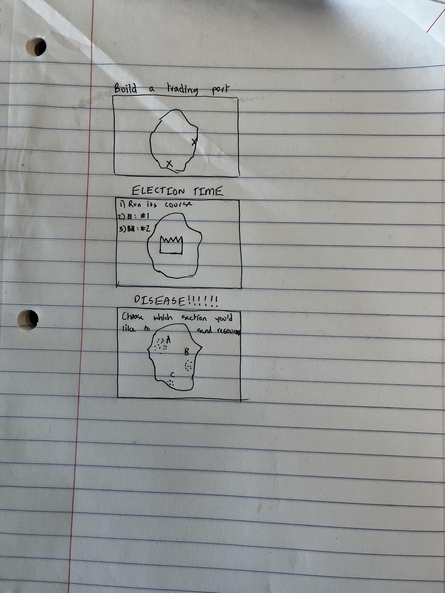

# Global Leader

Author: Hridayesh Joshi

Design: This game would have allowed you to build up your own country by simulating real-world scenarios beyond just disease, unlike disease.

Text Drawing: I was planning on precomputing the texts as I can just select the right one at runtime.

Choices: (TODO: how does the game store choices and narrative? How are they authored? Anything nifty you want to point out?)

Screen Shot:

How To Play:

The goal of the game is to make your country as strong as possible. This would have been measured by wealth and population. 
The plan was to have a set of options for each scenario that may rise up, and there would be boxes on the side that would allow 
you to select one of those options.

This game was built with [NEST](NEST.md).

